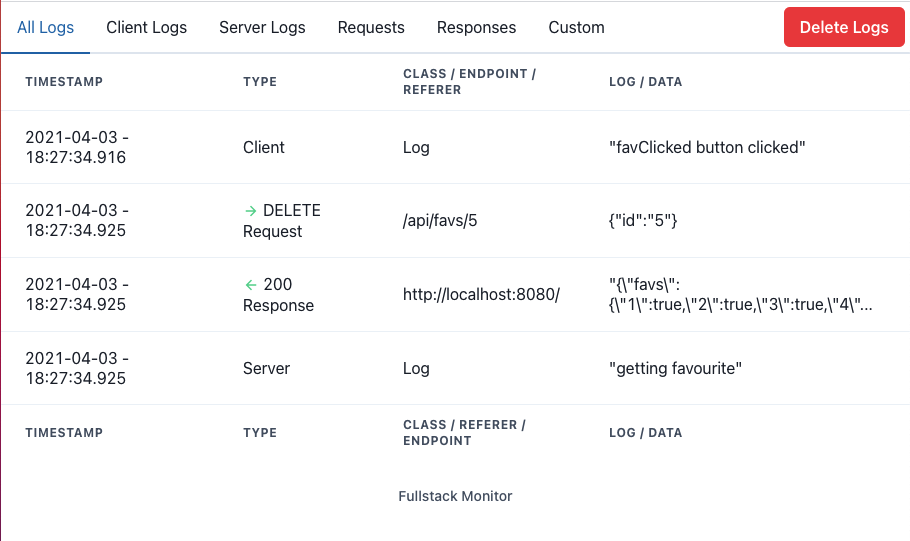
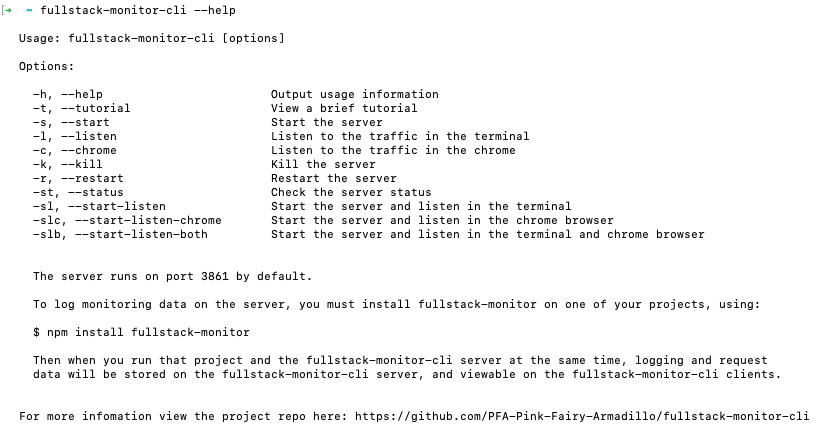
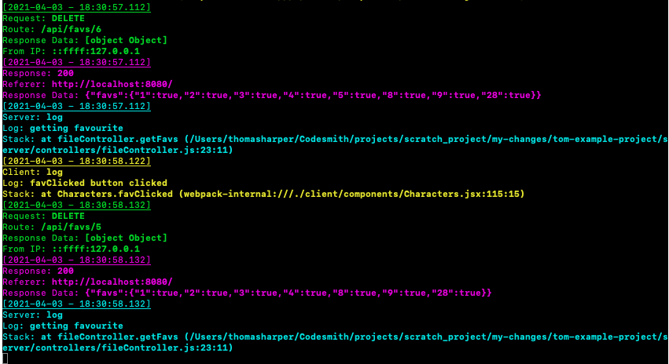

- [About](#about)
  - [Browser Interface](#browser-interface)
  - [Command Line Interface](#command-line-interface)
  - [Instructions](#instructions)
  - [Example Project](#example-project)
  - [Contributors](#contributors)

# About
Fullstack-monitor-CLI is log monitoring tools for developers, offering visibility of console logs, requests and responses from both the Client and Server side of your application in one single place.

This makes it easy to see what is happening across the stack as your front and back-end communicate.

In order to use this, you must also install the [Fullstack-Monitor](https://github.com/PFA-Pink-Fairy-Armadillo/fullstack-monitor) into the project you want to monitor.

- [Fullstack-Monitor Github](https://github.com/PFA-Pink-Fairy-Armadillo/fullstack-monitor).
- [Fullstack-Monitor NPM Package](https://www.npmjs.com/package/fullstack-monitor)

- [Fullstack-Monitor-CLI NPM Package](https://www.npmjs.com/package/fullstack-monitor-cli).

## Browser Interface

- This is what the browser interface looks like, when monitoring a fullstack application. You can see Client and Server logs, and requests and responses between the Client and the Server.
- You can use use the `--chrome` command to open this view in the Google Chrome browser, or navigate to `localhost:3861` in your browser of choice, the application is served by default, once you have started the server using `--start`.



## Command Line Interface

- Here you can see an overview of the CLI commands:



- Here is the view using the `--listen` command, where you can see ane example  the logs, requests and responses of a fullstack application being monitored in one place.



## Instructions

1. Globally install `Fullstack-Monitor-CLI`
```
$ npm install -g fullstack-monitor-cli
```
2. Install `Fullstack-Monitor` into the project you wish to monitor:
```
$ npm install fullstack-monitor`
```
3. Follow the instructions [here](https://github.com/PFA-Pink-Fairy-Armadillo/fullstack-monitor) to configure `Fullstack-Monitor` in your project.
4. Boot the `Fullstack-Monitor-CLI` server.
```
$ fullstack-monitor-cli --start
```
5. Open the browser interface to view the logs:
```
$ fullstack-monitor-cli --chrome
```
6. Listen to logs in the terminal
```
$ fullstack-monitor-cli --listen
```
7. When you are done monitoring kill the server.
```
$ fullstack-monitor-cli --kill
```

## Example Project

For an example of `Fullstack-Monitor` installed on a project see this GitHub Repo here:

- [Example-Project](https://github.com/PFA-Pink-Fairy-Armadillo/Example-Project)

## Contributors

- [Paulo Choi](https://github.com/paulochoi)
- [Aye Moe](https://github.com/ayemmoe)
- [Mohammed Naser](https://github.com/mnaser11218)
- [Tom Harper](https://github.com/tommyrharper)
- [Xiao Li](https://github.com/xiaotongli)
- [Pat Liu](https://github.com/patrickliuhhs)
